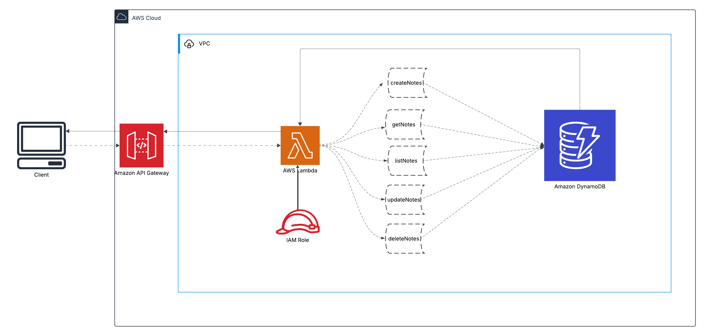
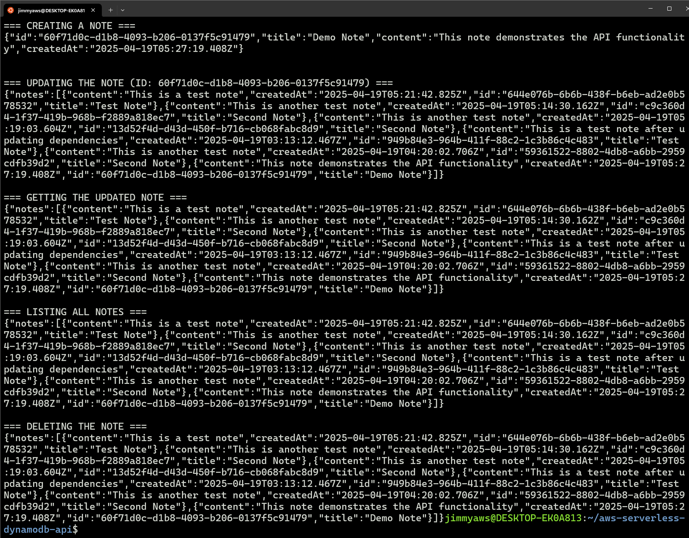

# 📝 Serverless REST API with DynamoDB


🔗 **Live Endpoint:** [https://384k1z4i7a.execute-api.us-east-1.amazonaws.com/Prod/](https://384k1z4i7a.execute-api.us-east-1.amazonaws.com/Prod/)(Note: This endpoint was active during development but has been decommissioned to avoid AWS charges. The screenshots demonstrate the working functionality.)

## 📋 Project Overview

This project implements a fully serverless REST API for a simple notes application, powered by AWS Lambda, API Gateway, and DynamoDB. The API allows users to create, read, update, and delete notes with persistent storage in a NoSQL database. And yes, building it with WSL was like trying to pet a cat with oven mitts — awkward, but ultimately rewarding!

---

## ✅ Key Features & Services

- 🔌 **API Gateway** - Fully managed HTTP API with auto-scaling
- ☁️ **AWS Lambda** - Serverless compute for API logic
- 📊 **DynamoDB** - NoSQL database for persistent storage
- 🔒 **IAM Roles** - Least privilege security model
- 🔄 **AWS SAM** - Infrastructure as Code for serverless deployment
- 🧩 **CRUD Operations** - Complete API resource management

---

## 🗺️ Architecture Overview



> The architecture follows AWS best practices for serverless applications, with API Gateway handling HTTP requests, Lambda functions processing business logic, and DynamoDB providing persistent storage.

---

## 📁 Project Structure

```bash
aws-serverless-dynamodb-api/
├── architecture/                     # AWS architecture diagram
│   └── aws-serverless-api-architecture.png
├── src/
│   ├── functions/                    # Lambda function handlers
│   │   ├── createNote.js
│   │   ├── getNote.js
│   │   ├── listNotes.js
│   │   ├── updateNote.js
│   │   └── deleteNote.js
│   └── lib/                             # Shared utility modules
│       ├── dynamodb.js                  # DynamoDB client and operations
│       └── responseUtil.js              # HTTP response formatter
├── template.yaml                        # AWS SAM template
├── package.json                         # Node.js dependencies
├── docs/                                # Additional documentation
│   └── serverless-api-logical-flow.md   # Detailed logical flow explanation
├── LICENSE
└── README.md
```

---

## 🛠 API Endpoints

The API provides the following endpoints for managing notes:

| Method | Endpoint | Description |
|--------|----------|-------------|
| GET | `/notes` | List all notes |
| GET | `/notes/{id}` | Get a specific note by ID |
| POST | `/notes` | Create a new note |
| PUT | `/notes/{id}` | Update an existing note |
| DELETE | `/notes/{id}` | Delete a note |

### API Testing Results



### Request/Response Examples

#### Create a Note (POST /notes)

Request:
```json
{
  "title": "Meeting Notes",
  "content": "Discuss project timeline and requirements"
}
```

Response:
```json
{
  "id": "59361522-8802-4db8-a6bb-2959cdfb39d2",
  "title": "Meeting Notes",
  "content": "Discuss project timeline and requirements",
  "createdAt": "2025-04-19T04:20:02.786Z"
}
```

#### Get a Note (GET /notes/{id})

Response:
```json
{
  "id": "949b84e3-964b-411f-88c2-1c3b86c4c483",
  "title": "Updated Note",
  "content": "This note has been updated via the API",
  "createdAt": "2025-04-19T03:13:12.467Z"
}
```

---

## 🧠 Skills Demonstrated

- Serverless architecture design and implementation
- NoSQL database modeling with DynamoDB
- API design and REST principles
- AWS Lambda function development
- Error handling and response standardization
- Infrastructure as Code using AWS SAM
- AWS IAM role configuration and security best practices
- Cloud resource management and deployment
- Troubleshooting deployment and runtime issues

---

## 🚀 Deployment Guide

### Prerequisites
- AWS CLI installed and configured
- AWS SAM CLI installed
- Node.js v22+ and npm

### Deployment Steps

1. **Clone the repository**
   ```bash
   git clone https://github.com/jimmyperalta-dev/aws-serverless-dynamodb-api.git
   cd aws-serverless-dynamodb-api
   ```

2. **Install dependencies**
   ```bash
   npm install
   ```

3. **Build and deploy the application**
   ```bash
   sam build
   sam deploy --guided
   ```

4. **Follow the prompts to complete deployment**

5. **Note the API Gateway endpoint URL from the deployment outputs**

---

## 🔄 Related Projects

- [Static Website Deployment](https://github.com/jimmyperalta-dev/aws-ec2-s3-route53-webapp)
- [EC2 Metrics Dashboard](https://github.com/jimmyperalta-dev/aws-ec2-monitoring-dashboard)
- [Serverless Contact Form API](https://github.com/jimmyperalta-dev/aws-s3-lambda-api-contactform)

---

## 👤 Author

**Jimmy Peralta**  
🛠️ Associate Media Systems Engineer | ☁️ AWS Cloud Enthusiast  
🌐 [https://www.deployjimmy.com](https://www.deployjimmy.com)